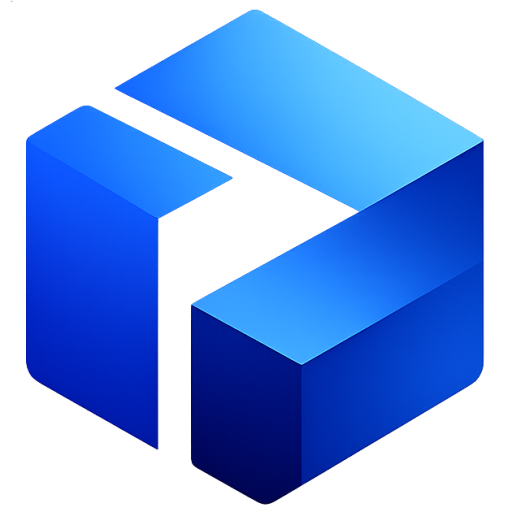
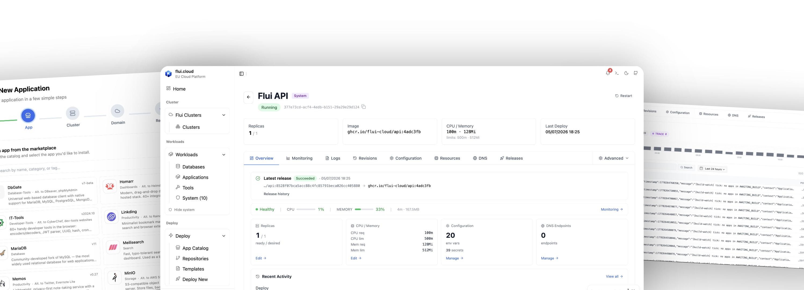
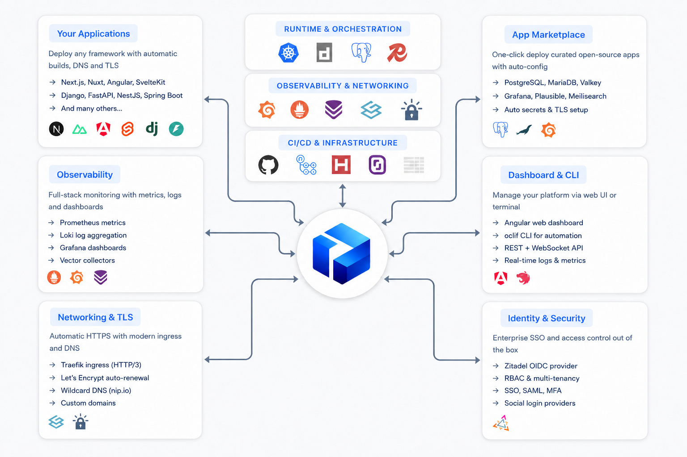

<p align="center">
  
</p>
<h1 align="center">Flui</h1>
 
<p align="center">
  <strong>The platform for independent cloud.</strong>
</p>
<p align="center">
  <em>Open source. Multi-provider. Yours to own and run.</em>
</p>
<p align="center">
  <a href="LICENSE"></a>
  <a href="https://github.com/flui-cloud/core/actions/workflows/docker-publish.yml"></a>
  <a href="https://github.com/flui-cloud/core/actions/workflows/security.yml"></a>
  <a href="https://www.npmjs.com/package/@flui-cloud/cli"></a>
</p>
<p align="center">
  <em>Flui is built around the <a href="https://github.com/flui-cloud/flui-spec"><code>flui.yaml</code></a> open specification.</em>
</p>

Flui is the open source platform for running independent cloud — modern infrastructure that works on the providers you choose, on the servers you own, or both. You bring the cloud credentials; Flui provisions a production-ready environment in about five minutes and runs your applications on it.

At its core, Flui is built around `flui.yaml` — an open manifest specification that describes a cloud application end-to-end, independently of any single platform implementation. The control plane is open source. The runtime lives on infrastructure you own. Every dependency Flui ships is open source too.

<p align="center"></p>

## Why Flui

Modern cloud experience and infrastructure ownership shouldn't require lock-in. Today, the tools to run production workloads on your own infrastructure are either fragmented (raw Kubernetes), proprietary (managed PaaS), or coupled to a specific implementation.

Flui exists to provide a complete platform around an open specification — `flui.yaml` — that any cloud-native application can adopt, independently of the platform that runs it. The result: a self-hosted control plane today, and a vendor-neutral way of describing cloud applications for the long term.

Supported infrastructure is centered on **European cloud providers**, while a pluggable adapter model keeps the door open to any provider.

## Quickstart

```bash
# 1. Install the CLI
npm install -g @flui-cloud/cli

# 2. Save your provider API token (encrypted, kept locally)
flui config set hetzner YOUR_HETZNER_TOKEN     # or: scaleway YOUR_SCALEWAY_TOKEN

# 3. Provision your environment (~5 minutes, valid HTTPS included)
flui env create --region nbg1 --node-size cx32

# 4. Sign in to the platform that just came up on your cluster
flui auth login
```

When `flui env create` returns, your environment is reachable over HTTPS at a stable `nip.io` URL — no domain required. Bring your own domain whenever you want; Flui handles the certificate dance for you.

Full guide → [docs.flui.cloud](https://docs.flui.cloud).

## What you get

A complete platform, not a starter kit. `flui env create` returns an environment ready for production:

- **Automatic routing and HTTPS** — no ingress configuration, no certificate manager to babysit. ACME automation included (HTTP-01, DNS-01 with wildcard, multi-domain SAN).
- **Built-in observability** — metrics, logs, dashboards, unified across every workload.
- **Single sign-on** for the platform and the apps you deploy on it.
- **Network, firewall and DNS** managed through the same CLI as your applications.
- **Real-time metrics, logs, scaling and lifecycle controls** for every app — from the CLI or the dashboard, both backed by the same `flui.yaml`.
- **No central tenant.** The Flui API and dashboard run on your environment, not on someone else's cloud.

## How you deploy an app

Three starting points, one open manifest format:

- **From the catalog** — pick a curated, self-hosted app (PostgreSQL, MariaDB, MinIO, Vaultwarden, Meilisearch, Uptime Kuma, …) and deploy in seconds.
- **From a framework template** — fork a template repo, push your code, Flui builds and deploys.
- **From your own `flui.yaml`** — write a manifest for any custom application.
  Whatever path you choose, every deploy converges on a `flui.yaml` your team can review, version, and replay.

```console
$ flui deploy ./flui.yaml

  Deploy from source

  File:    ./flui.yaml
  Cluster: production
  Repo:    acme/my-blog
  Branch:  main

  ✓ Build triggered

  App:      my-blog (my-blog-a1b2)
  Workflow: https://github.com/acme/my-blog/actions/workflows/flui-build.yml

  Waiting for build + deploy to complete (up to 35 min)…

  ✓ Building image via GitHub Actions     1m 38s
  ✓ Deploying to cluster                     24s
  ✓ Rolling out update                       12s
  ✓ "my-blog" is live

  URL: https://my-blog-a1b2.49-12-34-56.nip.io
  Run `flui app status my-blog-a1b2` for details.
```

## The `flui.yaml` manifest

At the core of Flui sits `flui.yaml` — an open specification for describing cloud applications independently of any single platform. The CLI and the dashboard operate on this format. So can other tools.

```yaml
kind: Application
apiVersion: flui/v1

metadata:
  name: my-blog

build:
  strategy: dockerfile
  dockerfile: ./Dockerfile

deploy:
  port: 3000
  exposure: public
  healthcheck:
    path: /health
  resources:
    profile: small
  scaling:
    min: 1
    max: 3
  domain:
    auto: true
    tls: true
```

> **`flui.yaml` is an open specification, governed independently from Flui.** Schema, examples, versioning policy and semantics live at **[github.com/flui-cloud/flui-spec](https://github.com/flui-cloud/flui-spec)** in a dedicated public repository. The spec is versioned independently from Flui itself, so any tool — not just this one — can read, write, and validate `flui.yaml` files. It exists to give cloud applications a vendor-neutral description format.

Validate any manifest locally with:

```bash
flui catalog validate ./my-app.flui.yaml
```

## Status

Flui is in **alpha**. I use it daily, the surface area is large, and things will change before 1.0.

| Working today                                                      | In progress                                       |
| ------------------------------------------------------------------ | ------------------------------------------------- |
| `flui env create` end-to-end on Hetzner & Scaleway                 | BYOS — install Flui on any SSH-reachable machine  |
| HTTPS out of the box (nip.io + ACME HTTP-01, DNS-01 wildcard, SAN) | Contabo provider exposed in the CLI               |
| Catalog of 20+ self-hosted apps and framework templates            | Catalog Level 2 — composed multi-component stacks |
| `flui.yaml` deploys with CLI validation                            | npm publication of `@flui-cloud/cli`              |
| Real-time metrics, logs, HPA + VPA scaling, lifecycle ops          | API stabilization toward 1.0                      |
| Network, firewall, DNS, dashboard, observability stack             |                                                   |

## Architecture

The control plane — this repo (API and CLI), [`dashboard`](https://github.com/flui-cloud/dashboard), and the [`flui-spec`](https://github.com/flui-cloud/flui-spec) — talks to your cloud provider and provisions a K3s-based cluster. The [`bootstrap-scripts`](https://github.com/flui-cloud/bootstrap-scripts) repo holds the cloud-init that installs the runtime and the built-in stack on each node.

> The boundary that matters is between _Flui control plane_ and _user-owned infrastructure_. Everything past that line — the cluster, the data, the certificates, the workloads — is yours.

Architecture deep dive → **[docs.flui.cloud/architecture](https://docs.flui.cloud/architecture)**.

Every component Flui ships is open source — by design, not by accident. Traefik and cert-manager for ingress, Prometheus, Loki, Grafana and Vector for observability, Zitadel for identity, PostgreSQL and Redis for data, K3s as the cluster runtime. Flui builds on the open source ecosystem rather than competing with it.

## Repository ecosystem

- **core** _(you are here)_ — backend API and CLI
- **[dashboard](https://github.com/flui-cloud/dashboard)** — Angular dashboard
- **[bootstrap-scripts](https://github.com/flui-cloud/bootstrap-scripts)** — provisioning scripts and runtime manifests
- **[flui-spec](https://github.com/flui-cloud/flui-spec)** — open specification of the `flui.yaml` manifest format
  More at [github.com/flui-cloud](https://github.com/flui-cloud).

## Links

- [Documentation](https://docs.flui.cloud) — guides, references, tutorials
- [Website](https://flui.cloud) — what Flui is and who it's for
- [Roadmap](https://github.com/orgs/flui-cloud/projects) — what's in progress, what's next
- [Issues](https://github.com/flui-cloud/core/issues) — bugs, requests, discussions

## Contributing

Issues and pull requests are welcome. For substantial changes, open an issue first to discuss the direction. The codebase is TypeScript (NestJS for the API, oclif for the CLI) and uses `pnpm`.

Local development means running several components side by side, or pointing the CLI at a stage environment on a supported provider. The current recommended workflow is in the [contributor setup guide](https://docs.flui.cloud).

## License

Flui is released under the [GNU Affero General Public License v3](LICENSE). Fully open source — no open core, no enterprise edition gating features.

---

<p align="center">
  <em>Built and maintained by <a href="https://gojodigital.com/">Dawit</a>.</em>
</p>
